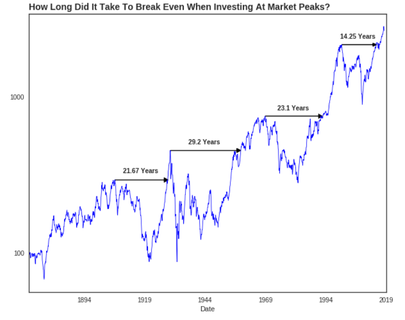

## Is 'Buy and Hold' a Good Investment Strategy?

#### Summary
Many legendary investors have stressed the importance of the Buy and Hold strategy. Studies have proven these investment legends correct by showing that investors typically hurt their profitability most when trying to time market oscillations. But the Buy and Hold strategy is not without its own risks. [CONTINUE READING](https://medium.com/@daniel_carter/is-buy-and-hold-a-good-investment-strategy-fe2d43266bb5), [VIEW CODE HERE](https://github.com/dcarter-ds/Analyzing-and-Visualizing-Buy-and-Hold-Strategy/blob/master/Buy_Hold_Notebook.ipynb)

#### Technical Overview
In my first Data Science project (ugh, so painful to look at the code), I combined some new data tools with years of finance experience to write about the most popular investment strategy in the world. An article on the visualizations and analysis is posted at the link above.

The reader's initial journey is a step-by-step guide on how to properly view stock charts -- lengthened, log-scaled and inflation-adjusted. With these somewhat simple modifications, long-term stock market trends become much more apparent. The duration and magnitude of these trends were plotted with the popular Python data visualization package Matplotlib.

From the visualizations, one can infer that some periods are much better for Buy and Hold than others. Because we don't get to choose our birth date (i.e. our investment lifespan), I simulated 200 random investment scenarios to show the readers worst-case scenarios, best-case scenarios and the average scenario. The seemingly sage advice of "Buy and Hold" does not look as great as one might expect.

The most challenging thing about this project was learning the fundamentals of Python and working with the datetime format (e.g. adding time to dates). If I did this project over again, I would scrape nber.org for the economic recession dates and store them in a dictionary object to drastically speed up the analysis. I would also add other variables to the simulations, such as investment fees and annual payments.

#### Technology Used
- Pandas
- Numpy
- Matplotlib
