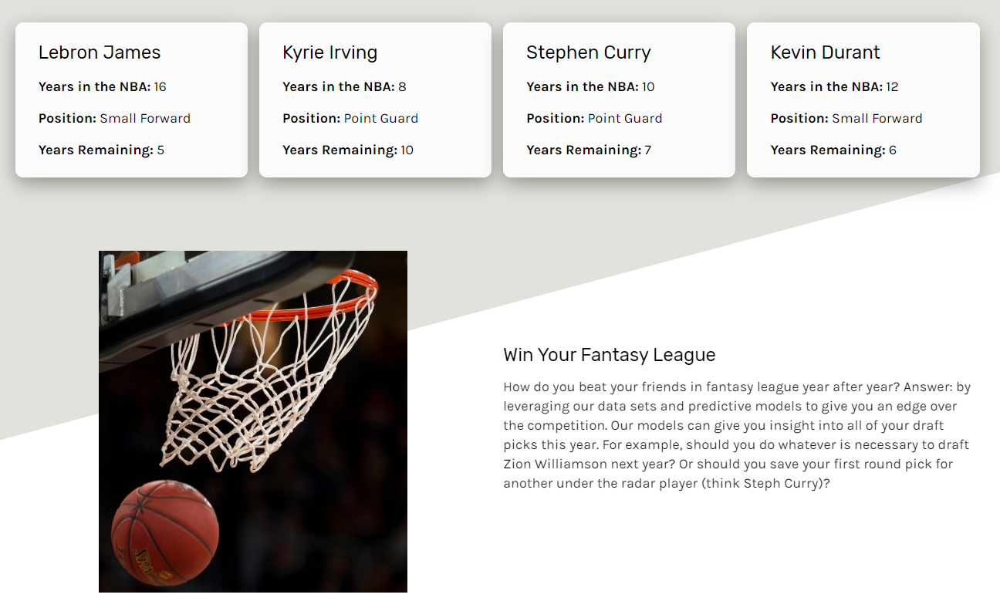
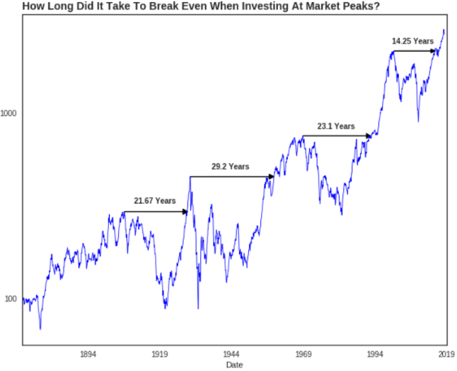
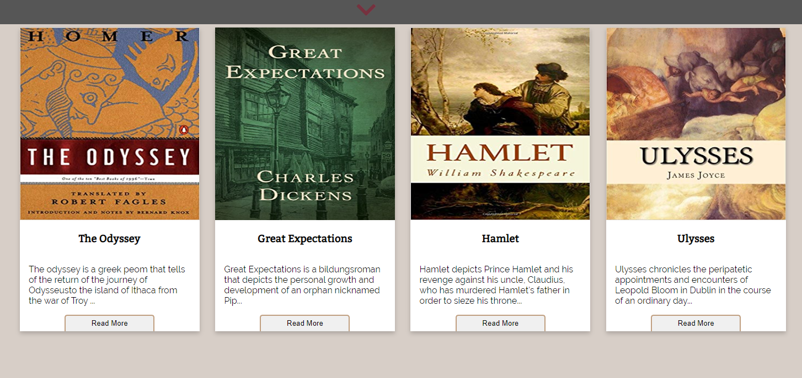
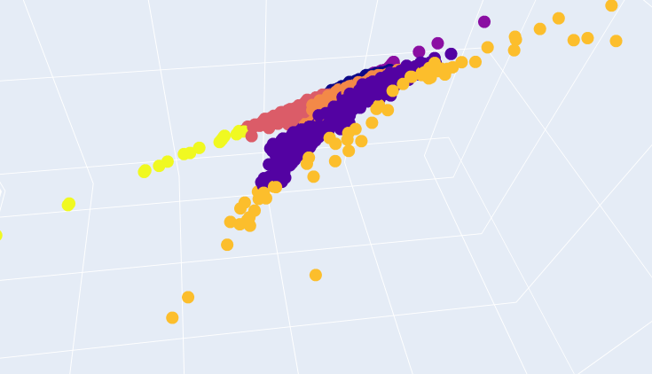
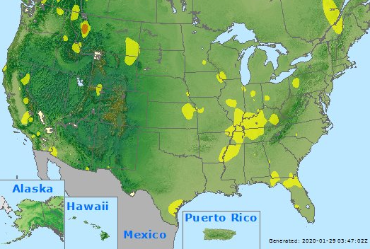

Welcome,

I'm a Freelance Data Scientist from Northern California with a background in Finance. My interests are markets, history, human nature and robotics.

## Projects

#### [NBA Career Longevity Predictor](nba_career)
Find out how long your favorite NBA players will last in the league with the NBA Career Predictor app.

#### [Is 'Buy and Hold' a Good Investment Strategy?](buy_and_hold)
Data visualizations that will make you think twice before using a "Buy and Hold" strategy.

#### [Reading Recommender](read_rec)
With the Reading Recommender app, take a simple survey and get recommended a great book based on your tastes.

#### [Deriving Meaning From Text Data](nlp)
In-depth analysis of unstructured text data using some of the leading-edge Natural Language Processing techniques.

#### [Air Quality Advertising](aqi)
An algorithm that scrapes air quality data from airnow.gov and converts the locations to zip codes for targeted advertising.

  

### Contact
- [Email](mailto:carteri246gmail.com)
- [GitHub](https://github.com/dcarter-ds)
- [Medium](https://medium.com/@daniel_carter)
