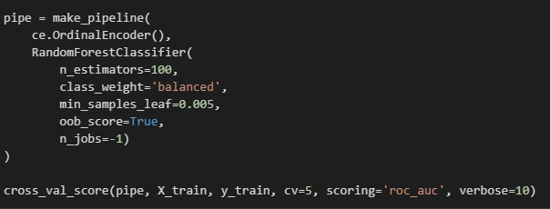

Welcome,

I'm a Freelance Data Scientist from Northern California with a background in Finance. My interests are markets, history, human nature and robotics.

## Projects

#### [NBA Career Longevity Predictor](nba_career)
Find out how long your favorite NBA players will last in the league with the NBA Career Predictor app.

#### [How to Derive Meaningful Insights From Text Data](nlp)
This real-world project covers some of the most cutting-edge Natural Langauge Processing techniques.

#### [Reading Recommender](read_rec)
With the Reading Recommender app, take a simple survey and get recommended a great book based on your tastes.

#### [Is 'Buy and Hold' a Good Investment Strategy?](buy_and_hold)
Data visualizations that will make you think twice before using a "Buy and Hold" strategy.

#### [Air Quality Advertising](aqi)
An algorithm that scrapes air quality data from airnow.gov and converts the locations to zip codes for targeted advertising.

#### [LendingClub Prediction](lend)
Predict the probability of loan charge-offs with a real dataset from peer-to-peer lending company LendingClub.

#### [Real-time Twitter Sentiment Dashboard](na)
Coming soon...

  

### Contact
- [Email](mailto:carteri246gmail.com)
- [GitHub](https://github.com/dcarter-ds)
- [Linkedin](https://www.linkedin.com/in/daniel-carter-15775717b/)
