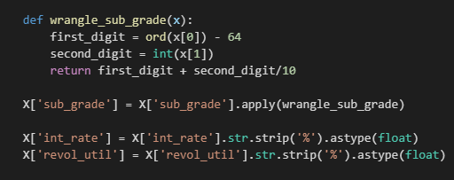

## LendingClub Prediction

#### Summary:
This Jupyter notebook walks through some of the most crucial steps in building a viable Machine Learning model, including feature engineering, hyperparameter tuning, permutation importances and model validation. [VIEW CODE HERE](https://github.com/dcarter-ds/dcarter-ds.github.io/blob/master/Lending_Club_Classification.ipynb)

#### Technical Overview:
The goal of this project was to build the most accurate Machine Learning model to predict whether or not a LendingClub loan would be charged off. One of the big challenges with this project was dealing with the size of the data (1.3 million rows). To cut down on overly lengthy processing times, I split the data into train, test and validation sets. This not only reduced processing times but gave me an extra holdout dataset for model validation.

Other issues were categorical features with high cardinality or high null value counts. To deal with the high cardinality features, it helped to combine categories. For example, "General Manager" and "Project Manager" were turned into "manager" in the employee title column. I simplified some of the high null columns by making nulls "True" and not nulls "False". This sounds overly simplistic but some of those columns did contribute predictive power.

To optimize the model, I used a combination of Scikit-learn's Gridsearch CV for hyperparameter tuning and ELI5's permutation importances (also to cut down on processing time by eliminating features). I also tried a variety of different classification models, including XGBoost, Gradient Boosting Classifier and Random Forest Classifier. XGBoost gave the best accuracy score.

#### Technology Used:
- Scikit-learn
- XGBoost
- ELI5
- Pandas
- Numpy
- Matplotlib
