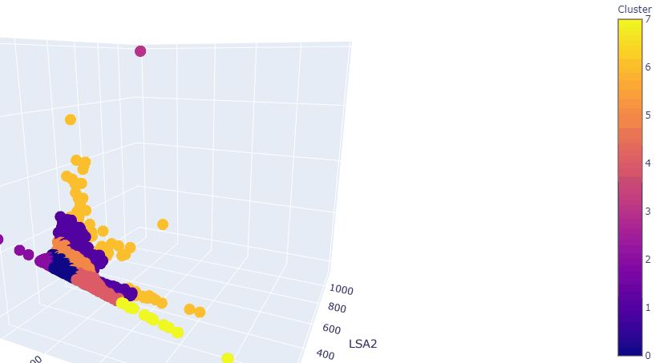

## How to Derive Meaningful Insights From Text Data

#### Summary:
Learn about the most cutting-edge techniques of Natural Language Processing from this real world analysis of unstructured, open-ended questionnaire responses. [VIEW PART I HERE](https://github.com/dcarter-ds/dcarter-ds.github.io/blob/master/Text_Analysis_Part_I.ipynb), [VIEW PART II HERE](https://github.com/dcarter-ds/dcarter-ds.github.io/blob/master/Text_Analysis_Part_II.ipynb)

(Note: Some code and data printouts have been redacted due to confidentiality)

#### Technical Overview:
The goal of this project was to discover what employees of a social services organization had learned from an online training course. The employees were presented with a short questionnaire where they provided open-ended responses relating to the course material. These responses were then given to me to analyze.

To learn as much as I could about the text data at hand, I first wanted to distinguish between low information responses and informative responses. This was not as easy as a simple word count (although I did include that) because some responses had high word counts but were gibberish. To find high information responses I feature engineered more variables, including percentage of unintelligible words, Flesch Kincaid Grade, Flesch Reading Ease and each response's TF-IDF vectorization. 

After the feature engineering, the dimensionality of the dataset was extremely large. I used Latent Semantic Analysis to shrink the dimensionality. Then I used K-means Clustering to visualize patters within the data (image above). This clustering helped me distinguish between low info responses and high info responses. The clustering even caught some outliers, where it appeared that a respondent copy and pasted part of the questionnaire in for their responses.

Once the clusters were discovered, I could further my analysis and do predictive modeling. I used a simple Logistic Regression model classify future responses (low info vs. high info) with over 90% accuracy.

To discover dominant themes within the responses, I used word cloud diagrams and topic modeling to further separate responses into more meaningful categories. I also made a rule-based classifier to discover suggestions on how to make improvements to the online course.

#### Technology Used:
- Pandas
- Numpy
- Plotly
- Scikit-learn
- NLTK
- Spacy
- Gensim
- pyLDAvis
- Wordcloud
