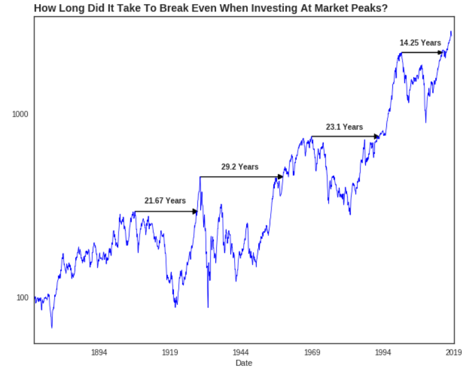

## Is 'Buy and Hold' a Good Investment Strategy?

Many legendary investors have stressed the importance of the Buy and Hold strategy. And studies show that investors hurt their profitability most when they try to time the oscillations of the market. But Buy and Hold may not always be a good idea. [CONTINUE READING](https://medium.com/@daniel_carter/is-buy-and-hold-a-good-investment-strategy-fe2d43266bb5)
